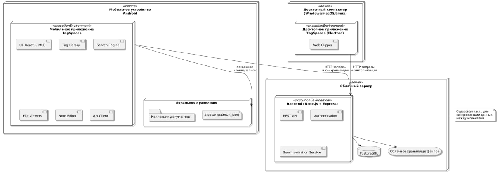

# Оффлайн-режим и синхронизация

## Полная работа без интернета

DocManager разработан как полностью оффлайн-приложение — это его ключевое преимущество.

### Что доступно оффлайн

- Просмотр всех документов
- Поиск (включая полнотекстовый)
- Добавление и редактирование тегов
- Создание заметок и описаний
- Фильтрация и сортировка

Интернет нужен только для опциональной синхронизации.

## Как работает синхронизация (опционально)

Если вы хотите резервное копирование или доступ с нескольких устройств:

1. Разверните собственный сервер (инструкция в отдельном репозитории).
2. В настройках приложения введите адрес сервера.
3. Нажмите «Синхронизировать».
4. Все изменения метаданных (теги, описания) передаются безопасно по HTTPS.

### Преимущества собственного сервера

- Полный контроль над данными
- Нет зависимости от сторонних облаков
- Возможность расширения в будущем (многопользовательский режим)

## Рекомендации по безопасности

- Храните важные документы только на устройстве.
- Регулярно делайте резервные копии папки с документами.
- Используйте пароль или биометрию на устройстве.

### Часто задаваемые вопросы

- **Можно ли использовать приложение без синхронизации?**  
  Да, это основной режим работы. Синхронизация полностью опциональна.

- **Что будет, если удалить приложение?**  
  Все документы останутся в выбранной папке на устройстве.

- **Поддерживается ли автоматическая синхронизация?**  
  Да, можно настроить по расписанию или при подключении к Wi-Fi.

[Все разделы документации](../../README.md)