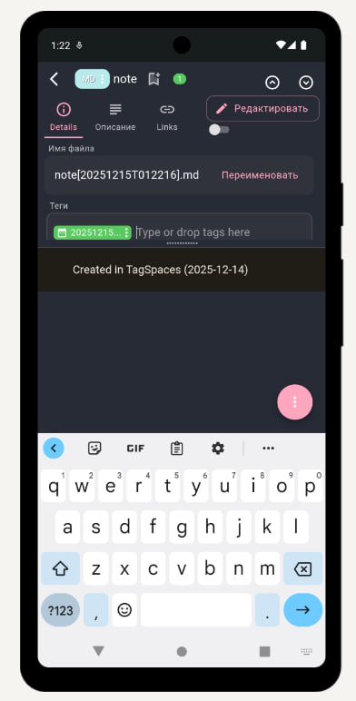

# Работа с тегами — мощная классификация документов

## Зачем нужны теги

Теги заменяют традиционные папки и позволяют одному документу принадлежать сразу нескольким категориям. Это особенно удобно для ИП, где один счёт может относиться к клиенту, проекту, году и статусу оплаты.

## Как создавать и присваивать теги

1. Откройте документ или выберите его в списке.
2. Нажмите на кнопку «Свойства» (или три точки → Свойства).
3. В разделе «Теги» нажмите «Добавить тег».
4. Введите название и выберите цвет из палитры.
5. Сохраните.

### Популярные наборы тегов для ИП

- Клиенты: `Клиент_Иванов`, `Клиент_Петров`
- Типы документов: `Договор`, `Счёт`, `Акт`, `Чек`, `Накладная`
- Статусы: `Оплачено`, `Не оплачено`, `Просрочено`
- Периоды: `2024`, `2025`, `1_квартал`
- Проекты: `Проект_Сайт`, `Проект_Ремонт`

## Фильтрация по тегам

- Откройте боковую панель (свайп слева или кнопка меню).
- Выберите один или несколько тегов.
- Поддерживается логика AND/OR (настраивается в фильтре).

### Пример комбинированной фильтрации

Вы хотите увидеть все неоплаченные счета за 2025 год:
1. Выберите тег `Счёт`
2. Выберите тег `2025`
3. Выберите тег `Не оплачено`

Результат — только нужные документы.

## Преимущества тегов перед папками

- Один документ в нескольких категориях одновременно.
- Быстрая смена статуса (перетащить с «Не оплачено» на «Оплачено»).
- Легко находить связи между документами.

[Назад: поиск](../basics/searching.md) | [Далее: оффлайн-режим](offline.md)