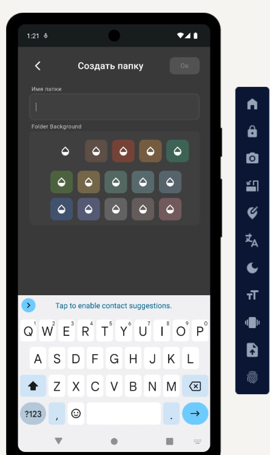

# Добавление и импорт документов

## Как добавить новые файлы в DocManager

Приложение работает с любой папкой на вашем устройстве. Вы можете добавлять документы несколькими способами.

### Способы добавления

- **Через кнопку в приложении**  
  На главном экране нажмите большую кнопку «+» в правом нижнем углу.

- **Из других приложений**  
  Используйте функцию «Поделиться» из галереи, файлового менеджера, почты или мессенджера.

- **Автоматически из выбранной папки**  
  Все новые файлы, помещённые в выбранную папку, будут автоматически обнаружены при следующем сканировании.

## Поддерживаемые форматы файлов

Приложение умеет работать с большинством популярных форматов:

- PDF (договоры, счета, акты)
- JPEG, PNG, WEBP (фото чеков, сканы, изображения)
- DOCX, TXT, RTF (текстовые документы)
- XLSX (таблицы, при наличии просмотрщика)

### Рекомендации по добавлению

1. Делайте фото чеков и сразу добавляйте их в приложение.
2. Сохраняйте полученные по почте PDF прямо в папку DocManager.
3. Используйте камеру для быстрого сканирования бумажных документов.
4. После добавления сразу присвойте теги — это сэкономит время при поиске.

## Пример рабочего процесса

1. Получили счёт от поставщика по email.
2. Сохраняете PDF в папку `/Documents/Business/Поставщики/`.
3. Открываете DocManager — файл уже появился в списке.
4. Присваиваете теги: `Счёт`, `Поставщик_ООО_Ромашка`, `2025`, `Не оплачено`.
5. Готово! Теперь счёт легко найти по любому из тегов.

[Вернуться на главную](../../README.md) | [Далее: поиск документов](searching.md)